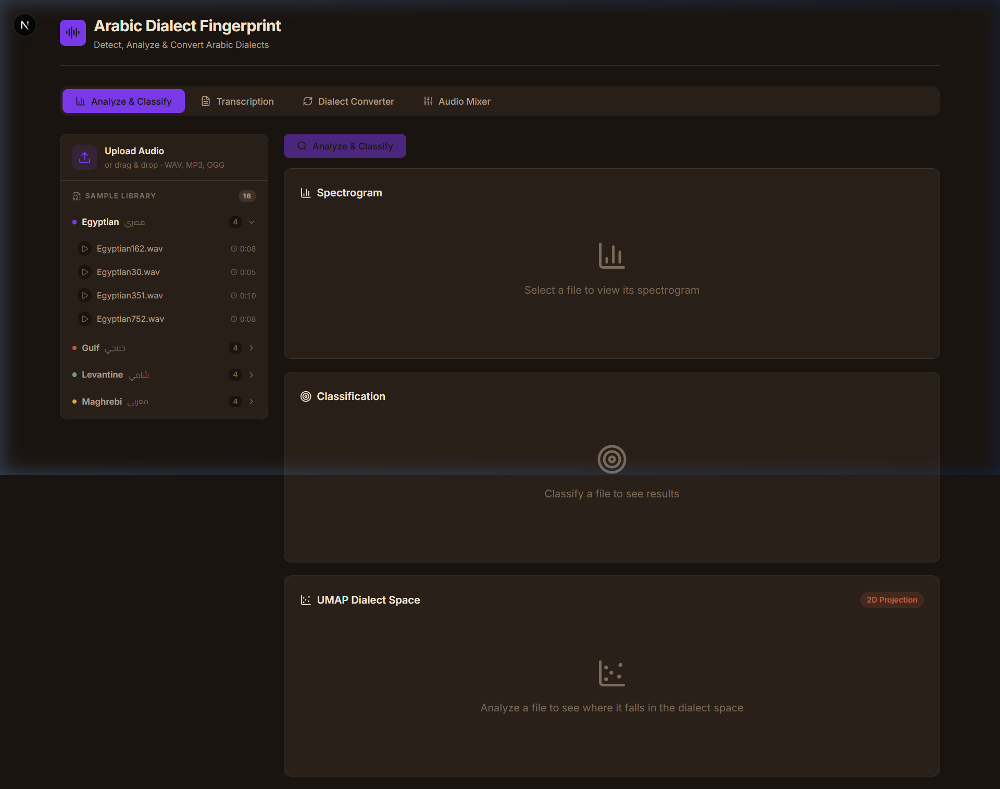
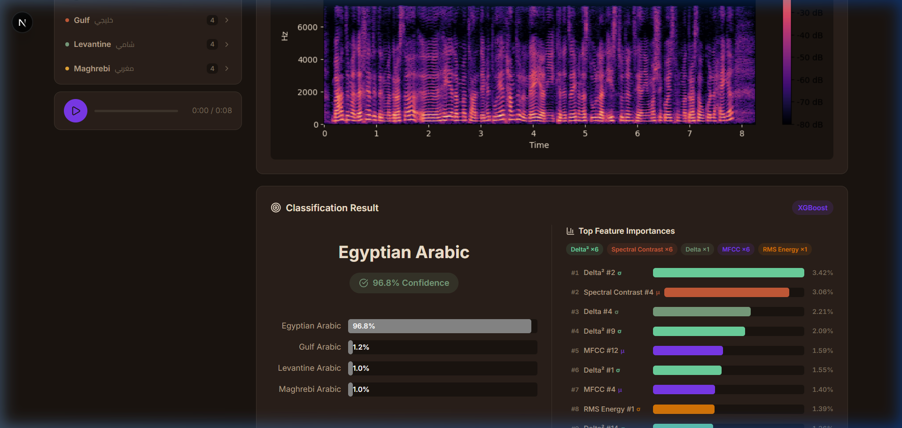
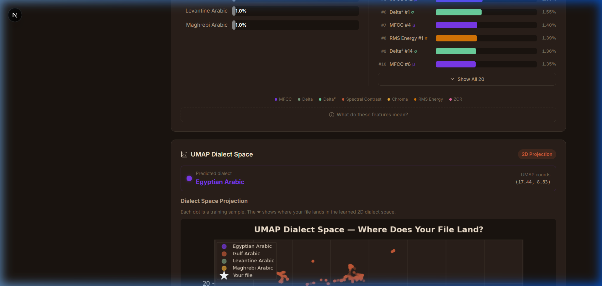
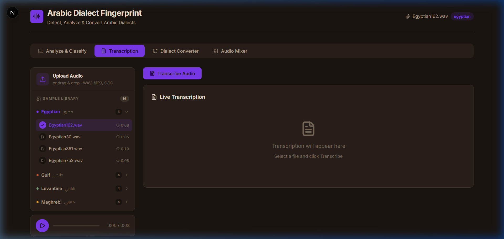
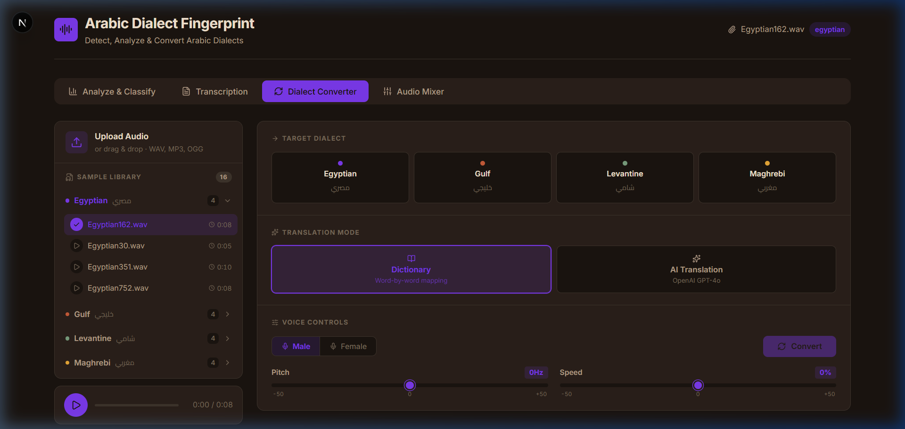
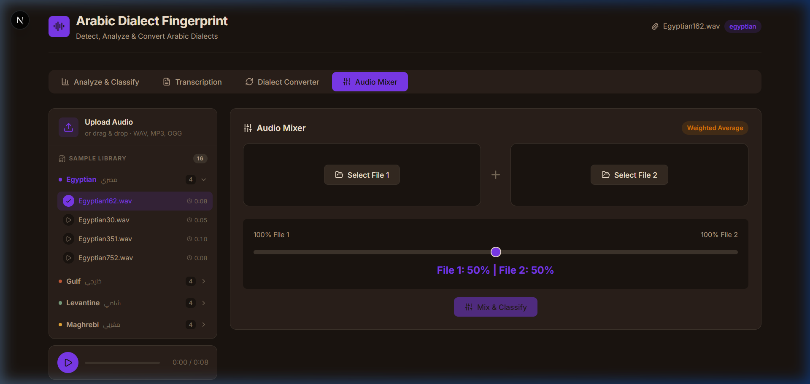

<![CDATA[# 🎙️ Arabic Dialect Fingerprinting System

> An AI-powered web application that analyzes spoken Arabic audio to detect, classify, transcribe, and convert between four major Arabic dialects using XGBoost, Whisper, SHAP explainability, and UMAP visualization.

---

## 📸 Application Screenshots

### Landing Page — Upload & Sample Library

*The main interface features a dark-themed UI with a sidebar containing a drag-and-drop upload zone and a curated sample library of 16 real Arabic dialect recordings (4 per dialect). The main area shows the Analyze & Classify tab with empty Spectrogram, Classification, and UMAP cards.*

---

### Spectrogram & Classification Results

*After clicking "Analyze & Classify", the system generates a full spectrogram visualization and runs the XGBoost classifier. Here an Egyptian sample is classified as **Egyptian Arabic with 96.8% confidence**. The right panel shows the Top 10 Feature Importances color-coded by category (Delta², Spectral Contrast, MFCC, RMS Energy).*

---

### UMAP 2D Dialect Space Projection

*The UMAP Dialect Space card projects the uploaded audio into a pre-fitted 2D scatter plot. Each dot represents a training sample colored by dialect. The ★ marker shows where the user's file lands relative to the learned dialect clusters, with exact UMAP coordinates displayed.*

---

### Transcription Tab (Whisper Large-v3)

*The Transcription tab uses OpenAI's Whisper Large-v3 model running locally with CUDA acceleration. It produces word-level timestamped segments with a live-highlight feature synced to audio playback.*

---

### Dialect Converter — Cross-Dialect Voice Conversion

*The Dialect Converter allows selecting a target dialect (Egyptian, Gulf, Levantine, Maghrebi), choosing between Dictionary-based word mapping or AI Translation (OpenAI GPT-4o), and configuring voice controls (gender, pitch, speed). The converted text is synthesized using ElevenLabs TTS with dialect-specific voices.*

---

### Audio Mixer — Weighted Dialect Blending

*The Audio Mixer lets users select two audio files from the sample library or upload custom files, adjust a weighted blend slider (0-100%), and run "Mix & Classify" to see how blending affects the dialect classification.*

---

## 🏗️ System Architecture

```
┌─────────────────────────────────────────────────────────┐
│                    Frontend (Next.js 16)                 │
│  React 19 · Lucide Icons · Vanilla CSS Design System    │
│                                                         │
│  ┌──────────┐ ┌──────────┐ ┌──────────┐ ┌────────────┐ │
│  │ Analyze  │ │Transcribe│ │ Convert  │ │   Mixer    │ │
│  │& Classify│ │  (STT)   │ │ Dialect  │ │  & Blend   │ │
│  └────┬─────┘ └────┬─────┘ └────┬─────┘ └─────┬──────┘ │
└───────┼────────────┼────────────┼──────────────┼────────┘
        │            │            │              │
        ▼            ▼            ▼              ▼
┌─────────────────────────────────────────────────────────┐
│               Backend (FastAPI / Uvicorn)                │
│                                                         │
│  Routes:                                                │
│  POST /api/upload          → File upload & registration │
│  GET  /api/samples         → List sample library        │
│  GET  /api/file/{id}       → Serve audio for playback   │
│  POST /api/spectrogram     → Generate spectrograms      │
│  POST /api/classify        → XGBoost dialect prediction  │
│  POST /api/features        → SHAP explainability charts │
│  POST /api/umap/project    → UMAP 2D projection        │
│  POST /api/transcribe      → Whisper transcription      │
│  POST /api/convert-dialect → Translate + synthesize     │
│  POST /api/synthesize      → Direct TTS synthesis       │
│  POST /api/mix-and-classify→ Mix two files + classify   │
│  GET  /api/health          → Health check               │
│                                                         │
│  Core Modules:                                          │
│  ├── dialect_classifier.py  (XGBoost inference)         │
│  ├── audio_processor.py     (Feature extraction)        │
│  ├── feature_visualizer.py  (SHAP + comparison plots)   │
│  ├── umap_visualizer.py     (KNN-based UMAP projection) │
│  ├── transcriber.py         (Whisper Large-v3)          │
│  └── dialect_converter.py   (Dict/AI translate + TTS)   │
└─────────────────────────────────────────────────────────┘
        │
        ▼
┌─────────────────────────────────────────────────────────┐
│                  ML Models (backend/models/)             │
│                                                         │
│  arabic_dialect_xgboost_model.pkl  (XGBoost pipeline)   │
│  label_encoder.pkl                 (Label mapping)      │
│  umap_reducer.pkl / umap_scaler.pkl (UMAP artifacts)   │
│  umap_kmeans.pkl / umap_cluster_to_dialect.pkl          │
│  lda.pkl / scaler.pkl              (LDA diagnostics)    │
│  X_train_2d.npy / y_train.npy     (Training embeddings)│
└─────────────────────────────────────────────────────────┘
```

---

## 📁 Repository Structure

```
Task5/
├── README.md                          # This file
├── VISUALIZATION_PIPELINE.md          # Technical pipeline documentation
├── .gitignore
│
├── backend/                           # FastAPI Python server
│   ├── main.py                        # App entry point, CORS, router registration
│   ├── audio_processor.py             # Audio loading, spectrograms, feature extraction
│   ├── dialect_classifier.py          # XGBoost model loading & inference (16kHz, 162 features)
│   ├── feature_visualizer.py          # SHAP explainability, comparison plots, heatmaps
│   ├── umap_visualizer.py             # Pre-fitted UMAP projection via KNN interpolation
│   ├── transcriber.py                 # Whisper Large-v3 with CUDA, streaming support
│   ├── dialect_converter.py           # Dictionary & AI translation, ElevenLabs TTS
│   ├── generate_samples.py            # TTS sample generation script (edge-tts)
│   ├── requirements.txt               # Python dependencies
│   ├── routes/
│   │   ├── upload.py                  # File upload + sample library listing
│   │   ├── analysis.py                # Spectrogram, classification, feature routes
│   │   ├── transcription.py           # Whisper transcription route
│   │   ├── conversion.py              # Dialect conversion + synthesis routes
│   │   ├── mixer.py                   # Audio mixing + classification route
│   │   └── umap.py                    # UMAP projection route
│   ├── models/                        # Serialized ML model artifacts
│   │   ├── arabic_dialect_xgboost_model.pkl
│   │   ├── label_encoder.pkl
│   │   ├── umap_reducer.pkl
│   │   ├── umap_scaler.pkl
│   │   ├── umap_kmeans.pkl
│   │   ├── umap_cluster_to_dialect.pkl
│   │   ├── lda.pkl / scaler.pkl
│   │   ├── X_train_2d.npy / y_train.npy
│   │   └── pca_lda_thresholds.json
│   └── audio_samples/                 # 16 real Arabic dialect recordings
│       ├── egyptian/   (4 files)
│       ├── gulf/       (4 files)
│       ├── levantine/  (4 files)
│       └── maghrebi/   (4 files)
│
├── frontend/                          # Next.js 16 / React 19 web application
│   ├── package.json
│   ├── src/
│   │   ├── app/page.js                # Main page with tab navigation
│   │   ├── lib/api.js                 # API client (fetch wrappers for all endpoints)
│   │   └── components/
│   │       ├── FileUploader.js        # Upload zone + sample library browser
│   │       ├── AudioPlayer.js         # Waveform audio playback
│   │       ├── SpectrogramViewer.js   # Toggle: Spectrogram / Mel / Waveform
│   │       ├── ClassificationResult.js# Dialect prediction + feature importances
│   │       ├── FeatureVisualizer.js   # SHAP + heatmap charts
│   │       ├── UMAPVisualizer.js      # 2D dialect scatter plot
│   │       ├── TranscriptionPanel.js  # Word-level timestamped transcript
│   │       ├── DialectConverter.js    # Cross-dialect conversion UI
│   │       └── AudioMixer.js          # Weighted audio blending UI
│   └── ...
│
├── ML_Train/                          # Training pipeline (offline)
│   ├── main.py                        # End-to-end training orchestrator
│   ├── preprocessing.py               # Audio loading & preprocessing
│   ├── feature_extraction.py          # 162-feature extraction pipeline
│   ├── train.py                       # XGBoost model training
│   ├── evaluate.py                    # Model evaluation & metrics
│   ├── visualization.py               # Training visualization plots
│   ├── utils.py                       # Utility functions
│   ├── requirements.txt               # Training dependencies
│   ├── data/                          # Training dataset
│   └── outputs/                       # Training outputs & artifacts
│
├── scratch/                           # Debugging & test scripts
│   ├── test_xgb.py
│   ├── test_shap.py
│   └── ...
│
└── docs/screenshots/                  # README screenshots
```

---

## 🔬 Technical Deep Dive

### 1. Feature Extraction Pipeline (162 Features)

The ML pipeline is built around a strict **16 kHz sample rate**. Audio is pre-emphasized and trimmed to 5 seconds. The `extract_features` function in `dialect_classifier.py` extracts exactly **162 statistical features**:

| Feature Family | Coefficients | Stats | Count | Index Range |
|---|---|---|---|---|
| **MFCC** | 20 | Mean + Std | 40 | 0–39 |
| **Delta MFCC** | 20 | Mean + Std | 40 | 40–79 |
| **Delta² MFCC** | 20 | Mean + Std | 40 | 80–119 |
| **Chroma** | 12 | Mean + Std | 24 | 120–143 |
| **Spectral Contrast** | 7 | Mean + Std | 14 | 144–157 |
| **ZCR** | 1 | Mean + Std | 2 | 158–159 |
| **RMS Energy** | 1 | Mean + Std | 2 | 160–161 |
| **Total** | | | **162** | |

### 2. XGBoost Classification

- The trained model (`arabic_dialect_xgboost_model.pkl`) is a **scikit-learn Pipeline** containing a `StandardScaler` → `XGBClassifier`.
- It outputs probability distributions across 4 classes: Egyptian, Gulf, Levantine, Maghrebi.
- The `label_encoder.pkl` maps numeric predictions back to dialect names.

### 3. SHAP Explainability Dashboard

The system uses `shap.TreeExplainer` to provide transparent, model-aligned explanations:

- **Top 7 SHAP Features:** A horizontal bar chart showing which features most influenced the prediction. Green bars = increased confidence, Red bars = decreased confidence.
- **Category Impact Heatmap:** The 162 SHAP values are grouped into 4 categories (Vocal Tract, Speech Dynamics, Tonal Profile, Spectral Shape). A **Softmax** function converts raw SHAP sums into a smooth 0–100% distribution per dialect, guaranteeing mathematical alignment with the XGBoost prediction.

### 4. UMAP Visualization

- A pre-fitted UMAP reducer (`umap_reducer.pkl`) and KMeans clusterer project 162-dimensional features into 2D.
- New uploads are projected using **KNN interpolation** (no numba required) by finding the nearest neighbors in the scaled training data and averaging their 2D positions.
- The scatter plot shows all training samples colored by dialect, with a ★ marking the uploaded file's position.

### 5. Whisper Transcription

- Uses OpenAI's **Whisper Large-v3** model loaded locally.
- Automatically detects and uses CUDA GPU acceleration when available.
- Produces **word-level timestamps** for a live-highlight experience synced to audio playback.
- Also supports real-time streaming transcription via WebSocket.

### 6. Dialect Converter

The conversion pipeline has two modes:

| Mode | Method | Description |
|---|---|---|
| **Dictionary** | `dialect_converter.py` | Word-by-word mapping using curated dialect dictionaries with hundreds of entries per dialect pair |
| **AI Translation** | OpenAI GPT-4o | Full contextual rewriting of the text into the target dialect's vocabulary and syntax |

After text conversion, speech is synthesized using the **ElevenLabs API** with dialect-specific voice IDs (male/female options for each dialect).

### 7. Audio Mixer

- Loads two audio files, resamples both to 22050 Hz.
- Applies weighted averaging: `mixed = (1 - weight) × audio1 + weight × audio2`.
- Normalizes the result and runs dialect classification on the blended output.
- Returns the mixed audio (playable in-browser), spectrogram, and classification probabilities.

---

## ⚙️ Setup & Installation

### Prerequisites
- **Python** 3.9+
- **Node.js** 18+
- **CUDA** (optional, for GPU-accelerated Whisper)
- **API Keys:**
  - `OPENAI_API_KEY` — for AI-mode dialect text conversion (GPT-4o)
  - ElevenLabs account — for TTS voice synthesis

### Backend

```bash
cd backend
pip install -r requirements.txt
```

Set your environment variables:
```bash
# Windows PowerShell
$env:OPENAI_API_KEY = "your-openai-key"

# Linux/Mac
export OPENAI_API_KEY="your-openai-key"
```

Start the server:
```bash
python -m uvicorn main:app --reload
```
The API runs at `http://localhost:8000`.

### Frontend

```bash
cd frontend
npm install
npm run dev
```
Open `http://localhost:3000` in your browser.

---

## 📦 Key Dependencies

### Backend
| Package | Purpose |
|---|---|
| `fastapi` + `uvicorn` | Async web framework & ASGI server |
| `librosa` | Audio loading, feature extraction, spectrograms |
| `xgboost` | Gradient boosted tree classifier |
| `shap` | Model explainability (TreeExplainer) |
| `umap-learn` | Dimensionality reduction |
| `scikit-learn` | StandardScaler, KMeans, label encoding |
| `openai-whisper` | Speech-to-text transcription |
| `elevenlabs` | Text-to-speech synthesis |
| `matplotlib` | Server-side plot generation |
| `soundfile` | Audio I/O |

### Frontend
| Package | Purpose |
|---|---|
| `next` 16.2.6 | React framework with SSR |
| `react` 19.2.4 | UI component library |
| `lucide-react` | Icon system |

---

## 🗂️ Audio Samples

The `backend/audio_samples/` directory contains **16 real Arabic dialect recordings** organized by dialect:

| Dialect | Files | Description |
|---|---|---|
| **Egyptian** (مصري) | `Egyptian162.wav`, `Egyptian30.wav`, `Egyptian351.wav`, `Egyptian752.wav` | Native Egyptian Arabic speech |
| **Gulf** (خليجي) | `Gulf298.wav`, `Gulf373.wav`, `Gulf380.wav`, `Gulf903.wav` | Native Gulf Arabic speech |
| **Levantine** (شامي) | `Levantine343.wav`, `Levantine345.wav`, `Levantine382.wav`, `Levantine416.wav` | Native Levantine Arabic speech |
| **Maghrebi** (مغربي) | `Maghrebi19.wav`, `Maghrebi221.wav`, `Maghrebi40.wav`, `Maghrebi47.wav` | Native Maghrebi Arabic speech |

These samples are served via the `/api/samples` endpoint and displayed in the frontend's Sample Library sidebar.

---

## 🔌 API Reference

| Method | Endpoint | Description |
|---|---|---|
| `POST` | `/api/upload` | Upload an audio file (multipart form) |
| `GET` | `/api/samples` | List all sample files by dialect |
| `GET` | `/api/file/{file_id}` | Stream an audio file for playback |
| `POST` | `/api/spectrogram` | Generate Spectrogram + Mel + Waveform images |
| `POST` | `/api/classify` | Run XGBoost dialect classification |
| `POST` | `/api/features` | Generate SHAP + comparison charts |
| `POST` | `/api/umap/project` | Project audio into 2D UMAP space |
| `POST` | `/api/transcribe` | Transcribe audio with Whisper |
| `POST` | `/api/convert-dialect` | Transcribe → Translate → Synthesize |
| `POST` | `/api/synthesize` | Direct text-to-speech synthesis |
| `POST` | `/api/mix-and-classify` | Mix two audio files and classify |
| `GET` | `/api/dialect-voices` | List available dialect voice options |
| `GET` | `/api/health` | Health check |

All `POST` endpoints (except `/upload`) accept JSON with `{ "file_id": "..." }`.

---

## 🧠 ML Training Pipeline (`ML_Train/`)

The training pipeline is a standalone Python project that produces the model artifacts used by the backend:

| Script | Purpose |
|---|---|
| `main.py` | End-to-end orchestrator: preprocess → extract → train → evaluate |
| `preprocessing.py` | Audio loading, resampling to 16kHz, trimming to 5s |
| `feature_extraction.py` | Extracts the 162 features (MFCC, Delta, Chroma, Contrast, ZCR, RMS) |
| `train.py` | Trains the XGBoost classifier with StandardScaler pipeline |
| `evaluate.py` | Generates confusion matrices, classification reports, accuracy metrics |
| `visualization.py` | Produces training visualizations and analysis plots |
| `utils.py` | Shared utility functions |

### Training Data
- Source: Arabic dialect speech datasets
- Preprocessing: 16kHz resampling, 5-second clips, pre-emphasis
- Features: 162-dimensional vector per sample
- Model: XGBoost with StandardScaler preprocessing

---

## 🔒 Security Note

API keys are loaded from **environment variables** at runtime. Never commit API keys to the repository. The `.gitignore` is configured to exclude sensitive files.

```python
# How keys are loaded (dialect_converter.py)
api_key = os.environ.get('OPENAI_API_KEY', 'key')
```
]]>
